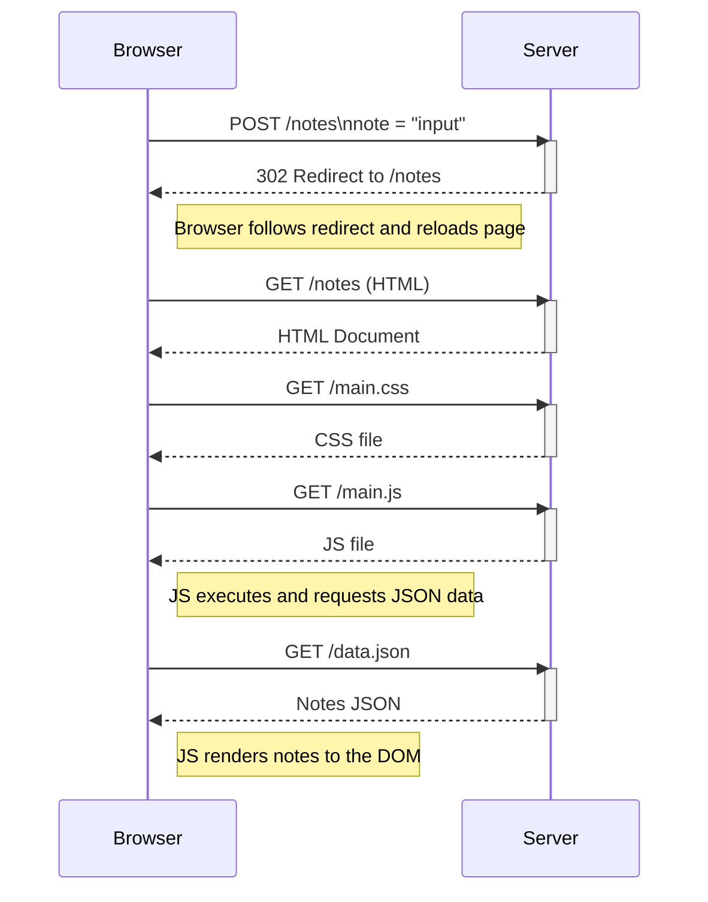

```mermaid
    sequenceDiagram
        participant Browser
        participant Server

        Browser->>Server: POST /notes\nnote = "input"
        activate Server
        Server-->>Browser: 302 Redirect to /notes
        deactivate Server

        Note right of Browser: Browser follows redirect and reloads page

        Browser->>Server: GET /notes (HTML)
        activate Server
        Server-->>Browser: HTML Document
        deactivate Server

        Browser->>Server: GET /main.css
        activate Server
        Server-->>Browser: CSS file
        deactivate Server

        Browser->>Server: GET /main.js
        activate Server
        Server-->>Browser: JS file
        deactivate Server

        Note right of Browser: JS executes and requests JSON data

        Browser->>Server: GET /data.json
        activate Server
        Server-->>Browser: Notes JSON
        deactivate Server

        Note right of Browser: JS renders notes to the DOM
```