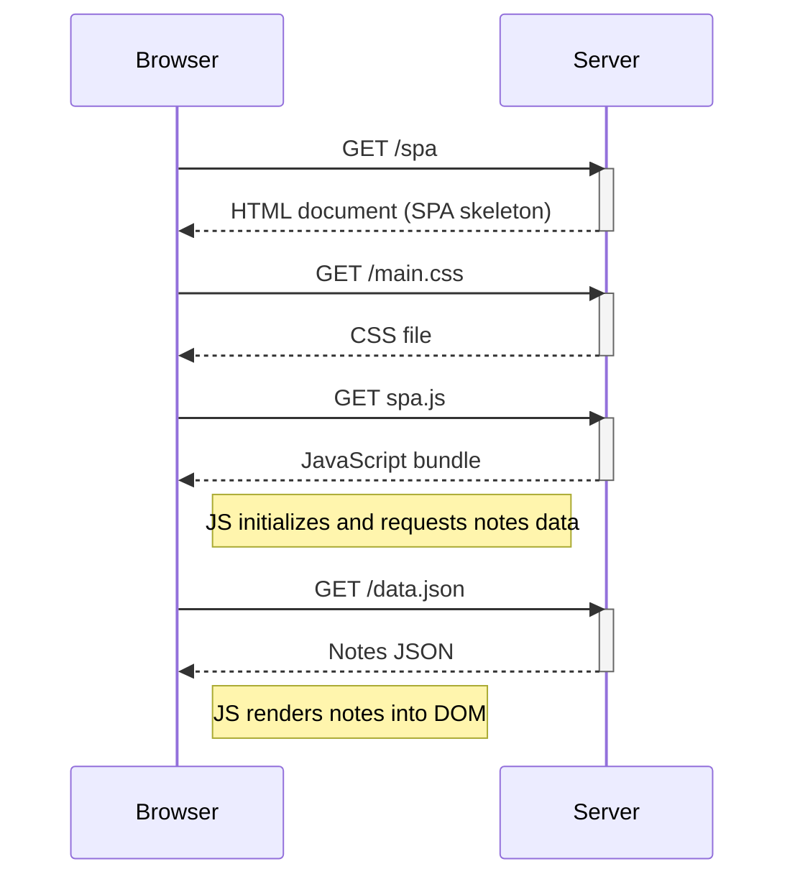

```mermaid
sequenceDiagram
    participant Browser
    participant Server

    Browser->>Server: GET /spa
    activate Server
    Server-->>Browser: HTML document (SPA skeleton)
    deactivate Server

    Browser->>Server: GET /main.css
    activate Server
    Server-->>Browser: CSS file
    deactivate Server

    Browser->>Server: GET spa.js
    activate Server
    Server-->>Browser: JavaScript bundle
    deactivate Server

    Note right of Browser: JS initializes and requests notes data

    Browser->>Server: GET /data.json
    activate Server
    Server-->>Browser: Notes JSON
    deactivate Server

    Note right of Browser: JS renders notes into DOM
```