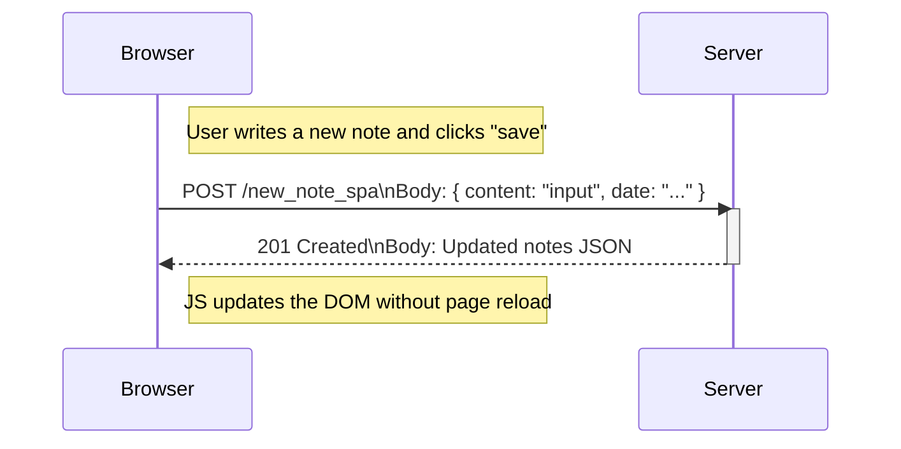

```mermaid
sequenceDiagram
    participant Browser
    participant Server

    Note right of Browser: User writes a new note and clicks "save"

    Browser->>Server: POST /new_note_spa\nBody: { content: "input", date: "..." }
    activate Server
    Server-->>Browser: 201 Created\nBody: Updated notes JSON
    deactivate Server

    Note right of Browser: JS updates the DOM without page reload
```